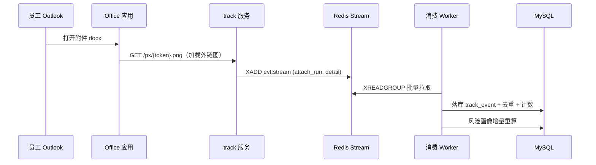

# 附件溯源设计方案（发送 / 渲染 / 溯源）

> 状态：设计定稿，一期已落地。落地范围：一期 benign_doc 直发 + beacon（docx/xlsx 注入，pdf/zip 透传）；二期下载链接模式；三期 EXE/宏（License 门控）。

## 1. 目标与结论

演练邮件携带附件（工资单、通知、发票等），员工打开附件即触发溯源事件，链路贯通"发送 → 渲染 → 打开 → 事件回流 → 报表/风险画像"。

**最佳方案一句话**：良性文档（docx/xlsx/pdf）**直发** + **文档内嵌外链图片 beacon** 溯源，**复用 `campaign_target.token`** 不引 rid，**统一渲染器分派**各载荷类型；EXE/宏载荷留三期，License 门控默认关闭。

## 2. 现状盘点（已有基础）

| 环节 | 现状 | 缺口 |
|---|---|---|
| 载荷管理 | `attachment_payload`（macro_doc/exe/other，MinIO 隔离桶，`attachment_download_log` 管理端下载审计） | 良性文档类类型、上传/预览接口未接 |
| 追踪开关 | `email_template.track_attach` 字段已建（默认 0） | 未接线 |
| 事件模型 | `track_event.event_type` 已含 `attach_run`；风险画像五维已含"附件下载" | 消费端无 attach_run 处理 |
| 邮件渲染 | `render_campaign_email` 已支持变量替换、QR 附件（cid）、像素注入，返回 `attachments` 数组 | 无载荷接入 |
| 发送管道 | worker `delivery.py` 已把 `rendered["attachments"]` 传给 `_smtp_send` | 可直接吃新附件 |
| 追踪域 | track 服务已有 `/px/{token}.png/gif`、`/t/{token}` | 缺 `/dl/` 下载路由（二期） |
| 前端原型 | 素材模板"附件与载荷"Tab、演练管理"触发附件下载"勾选已画好 | 未实现 |

骨架齐全，本次主要接通：`track_attach` 开关 → 变体渲染 → 发送 → 事件消费 → 报表。

## 3. 关键决策与理由

| 决策点 | 选择 | 理由 |
|---|---|---|
| 投递形态 | **直发 + 文档 beacon** 为主；下载链接模式为二期增强 | 直发才像"附件邮件"；beacon 不需员工点击，打开即溯源 |
| 溯源载体 | 复用 `token`，不另造 rid | token 已是 32 位不可猜测、唯一映射 campaign_target，链路零新增概念 |
| EXE 溯源 | 二进制**原位补丁**（定长占位符 URL 替换），不做每目标重编译 | 免交叉编译链；等长替换不动 PE 结构，秒级出变体 |
| 载荷生成 | 统一 `render_attachment_variant` 分派器，每 target 一份变体 + hash 留痕 | 溯源到文件级 + 合规证据（每个员工收到内容一致可证） |
| 事件链路 | 完全复用 `push_event → evt:stream → 消费落库` | 追踪侧禁写 MySQL 红线不变 |

## 4. 详细设计

### 4.1 载荷分类与存储

```
file_type: benign_doc(一期) / macro_doc(三期) / exe(三期)
benign_doc → 普通 MinIO 桶   attach/{payload_id}/src.docx
macro/exe  → 隔离桶 + License 门控 + 下载审计（默认关闭，红线 6）
```

### 4.2 投递形态

| 模式 | 做法 | 溯源信号 | 说明 |
|---|---|---|---|
| 直发模式（默认） | 附件真实随信，MIME multipart/mixed | 文档内嵌外链 beacon，打开时 Office 拉取 → `attach_run` | 离线客户端/安全软件拦截外部图片时不触发——预期内下限，报表注明 |
| 下载链接模式（二期） | 正文给 `/dl/{token}/{file}`，不直发 | 点击→下载即 `attach_run`，记 IP/UA | 可绕过网关附件过滤与外部图片拦截；需点击 |

### 4.3 统一渲染器（campaign/render.py 扩展）

```python
def render_attachment_variant(payload, target, token) -> bytes:
    """每 target 渲染专属附件变体。"""
    match payload.file_type:
        case "benign_doc": return render_docx_variant(payload, target, token)  # 占位符+beacon
        case "exe":        return patch_exe_token(payload.raw, token)          # 原位补丁
        case "macro_doc":  return inject_ole_attr(payload.raw, token)          # OLE 文档属性
        case _:            raise UnsupportedPayloadType(payload.file_type)
```

- 在 worker 内异步渲染（复用 `delivery.py` 现有渲染点），docx 很小，千人规模无压力；
- 变体存 `attach/{campaign_id}/{target_id}/render.docx`，hash 记入 `campaign_target.attach_variant_hash`；
- 渲染完成后追加进 `rendered["attachments"]`，走现有 `_smtp_send` 管道。

### 4.4 beacon 注入（docx 示例）

`word/document.xml` 尾部插入 drawing，关系文件加外链：

```xml
<!-- word/_rels/document.xml.rels -->
<Relationship Id="rIdBeacon" Type=".../image" Target="http://{tracking_domain}/px/{token}.png" TargetMode="External"/>
```

```xml
<!-- word/document.xml 内嵌 -->
<w:drawing><wp:inline><a:graphic><a:graphicData uri=".../picture">
  <pic:pic><pic:blipFill><a:blip r:embed="rIdBeacon"/></pic:blipFill>
</pic:pic></a:graphicData></a:graphic></wp:inline></w:drawing>
```

要点：
- beacon 用**降级大图**（复用 `tracking/stream.py::pixel_png_bytes()` 的 120×30 横幅），1×1 像素在文档里太可疑；
- `track_attach=0` 时不注入——文档无外链，零溯源；
- beacon 指向独立追踪域，与主平台隔离（红线 3）；
- **无需宏前置**：beacon 是渲染期拉取远程图片，非代码执行，与红线 6（宏/EXE 默认关闭）完全独立。实际触发前置条件是：① 员工退出受保护视图（微软 2022 起邮件附件带 MOTW，需点一次"启用编辑"）；② Office 客户端网络可达追踪域；③ 客户端未通过组策略禁用外部内容。三者缺一则无事件——`attach_run` 率低于像素 open 与 click 属预期，报表口径按"打开并允许内容加载"的设备级证据表述。

### 4.5 EXE 溯源（三期，License 门控）

自研良性探针 exe（只回连，无危害），源码内 URL 用定长占位符，发信时原位替换：

```python
# 模板内 URL:  http://d.example.com/px/__RID_00000000000000000000000000000000__.png
def patch_exe_token(raw: bytes, token: str) -> bytes:
    ph = b"__RID_" + b"0" * 32 + b"__.png"
    tok = b"__RID_" + token.encode() + b"__.png"
    assert len(ph) == len(tok)   # 等长替换，不动 PE 节表/偏移
    return raw.replace(ph, tok)
```

回连 URL 里的 token 即 `campaign_target.token`，track 服务按现有 `/px` 逻辑解析归属。
**归属口径**：exe 回连证明"该 IP/UA/凭证运行了文件"，不等于"该员工本人双击"（共享机器/远程桌面场景），报表标注"设备级证据"。
**红线**：宏/EXE 默认关闭（License 门控 + 下载审计 + 演练强制 `auth_confirmed` 授权勾选）；msfvenom 类真实 C2 载荷不作为平台内置能力。

### 4.6 事件与溯源链路

```
打开/下载 → track 服务 push_event("attach_run", detail={filename, variant_hash, mode})
         → Redis Stream evt:stream（追踪侧禁写 MySQL）
         → 消费端批量落库 track_event
         → 去重(token+event_type+时间窗)，detail.open_count 累计
         → 实时计数 cnt:{campaignId} 回写 campaign_stat
         → risk_recalc 增量重算风险画像（附件下载维度）
         → 演练详情漏斗 + 监控时间轴（IP/UA/时间/文件名/hash）
```

### 4.7 数据模型与路由增量

```sql
-- 演练↔载荷关联
CREATE TABLE campaign_attachment (
  id BIGINT AUTO_INCREMENT PRIMARY KEY,
  campaign_id BIGINT NOT NULL INDEX,
  payload_id  BIGINT NOT NULL,
  deliver_mode VARCHAR(8) DEFAULT 'inline' COMMENT 'inline/link',
  sort INT DEFAULT 0,
  UNIQUE KEY uk_campaign_payload (campaign_id, payload_id)
);

-- 目标表补变体留痕
ALTER TABLE campaign_target
  ADD COLUMN attach_variant_path VARCHAR(512),
  ADD COLUMN attach_variant_hash VARCHAR(64);
```

```python
# track 服务（二期）
@app.get("/dl/{token}/{filename}")
async def download(token: str, filename: str, request: Request):
    push_event(token, "attach_run", ip=..., ua=...,
               detail={"filename": filename, "mode": "link"})
    return FileResponse(...)  # 或 302 到 MinIO 预签名 URL
```

## 5. 实现流程图

### 5.1 总览（ASCII）

```
═══════════ 一、素材阶段（管理端）═══════════
┌────────────┐   ┌────────────┐   ┌────────────────┐   ┌──────────────────┐
│ 上传附件模板  │──▶│ 校验/前端预览 │──▶│ MinIO 模板存储   │──▶│ attachment_payload│
│ docx/xlsx/ │   │ (docx-preview│   │ payload/{id}/  │   │ file_type/hash   │
│ pdf/zip    │   │  /SheetJS)  │   │ src.docx       │   │ + track_attach   │
└────────────┘   └────────────┘   └────────────────┘   └──────────────────┘

═══════════ 二、演练投递（worker 批量，异步）═══════════
┌──────────────┐
│ 向导：选载荷   │
│ + 追踪开关     │──▶ campaign_attachment (campaign↔payload, deliver_mode)
│ + 授权勾选     │
└──────────────┘
                        ┌───────────────────────────────┐
                        │ render_attachment_variant     │
                        │ (每 target, 传 token)          │
                        │  ① docx/xlsx: {{.姓名}} 占位符替换 │
                        │      + 注入 beacon 外链图片     │
                        │      /pa/{token}.png（独立端点） │
                        │  ② (三期) exe: token 原位补丁    │
                        │  ③ (三期) macro: OLE 属性注入    │
                        └───────────────┬───────────────┘
                                        │
        ┌───────────────────────────────▼───────────────┐
        │ 变体落 MinIO attach/{cid}/{tid}/render.docx    │
        │ + campaign_target.attach_variant_hash 留痕      │
        └───────────────────────────────┬───────────────┘
                                        │ MIME multipart/mixed 组装
        ┌───────────────────────────────▼───────────────┐
        │ SMTP 直发（复用 delivery.py 现有 attachments 管道）│
        └───────────────────────────────────────────────┘

═══════════ 三、打开溯源（员工侧 + 追踪域）═══════════
┌──────────────┐   ┌────────────────┐   ┌─────────────────┐
│ 员工打开附件   │──▶│ Office 加载文档   │──▶│ 拉取外链 beacon   │
│ (邮件客户端)   │   │ (Word/Excel/WPS)│   │ (需联网加载图片)  │
└──────────────┘   └────────────────┘   └────────┬────────┘
                                                 │ 有网且未被拦截
                          ┌──────────────────────▼──────────────────────┐
                          │ track 服务 GET /px/{token}.png               │
                          │ push_event("attach_run",                    │
                          │   detail={filename, variant_hash, mode})     │
                          └──────────────────────┬──────────────────────┘
                                                 ▼
                          ┌─────────────────────────────────────────────┐
                          │ Redis Stream evt:stream（追踪侧禁写 MySQL）   │
                          └──────────────────────┬──────────────────────┘
                                                 │
═══════════ 四、事件落地与报表 ═══════════
                                                 ▼
        ┌────────────────────────────────────────────────────────────┐
        │ worker track_stream 消费：                                 │
        │  ① 落库 track_event(attach_run)                           │
        │  ② 去重 token+event_type+时间窗（detail 累计 open_count）   │
        │  ③ 实时计数 cnt:{campaignId} 回写 campaign_stat            │
        │  ④ 风险画像增量重算（附件下载维度）                           │
        └──────────────┬─────────────────────────────┬──────────────┘
                       ▼                             ▼
        ┌──────────────────────┐   ┌──────────────────────────────┐
        │ 演练详情：漏斗 attach_run│   │ 监控时间轴：每次打开           │
        │ 数/率 + 报表导出        │   │ IP/UA/时间/文件名/hash 溯源     │
        └──────────────────────┘   └──────────────────────────────┘
```

### 5.2 运行时链路（mermaid）

```mermaid
flowchart TD
    subgraph 素材阶段
        A1[上传附件模板<br/>docx/xlsx/pdf] --> A2[校验/前端预览]
        A2 --> A3[MinIO 模板存储<br/>payload/{id}/src.docx]
        A3 --> A4[(attachment_payload<br/>file_type/hash/track_attach)]
    end
    subgraph 演练投递
        B1[向导: 选载荷 + 追踪开关 + 授权勾选] --> B2[campaign_attachment]
        B2 --> B3[worker: render_attachment_variant<br/>每 target 传 token]
        B3 --> B4[变体落 MinIO<br/>+ attach_variant_hash 留痕]
        B4 --> B5[SMTP 直发<br/>multipart/mixed]
    end
    subgraph 打开溯源
        C1[员工打开附件] --> C2[Office 加载文档]
        C2 --> C3{联网且未被拦截?}
        C3 -- 是 --> C4[GET /px/{token}.png]
        C3 -- 否 --> C9[无事件<br/>预期内下限]
        C4 --> C5[push_event attach_run<br/>detail: filename/hash/mode]
        C5 --> C6[(Redis Stream<br/>evt:stream)]
    end
    subgraph 事件落地
        C6 --> D1[消费端批量落库 track_event]
        D1 --> D2[去重 token+event_type+时间窗]
        D2 --> D3[实时计数 cnt:{cid}]
        D2 --> D4[风险画像增量重算]
        D3 --> D5[演练详情漏斗/报表]
        D4 --> D6[监控时间轴<br/>IP/UA/文件名/hash]
    end
```



## 6. 红线与边界

1. **宏/EXE 默认关闭**——License 门控 + 下载审计 + 演练强制 `auth_confirmed` 授权勾选；
2. **beacon/下载走独立追踪域**，与主平台域名/IP 隔离（红线 3）；
3. 变体渲染仅用于客户对自有员工的授权演练（红线 8）；载荷模板可由 AI 生成但必须走 `ai_draft` 审核流；
4. 附件文件与事件受留存期策略清理；
5. 报表归属口径：附件溯源为**设备级证据**，不做"该员工必然运行"的绝对化表述。

## 7. 分期落地顺序

| 期 | 范围 | 备注 |
|---|---|---|
| 一期 MVP | benign_doc 直发 + beacon + attach_run 落库 + 风险画像接入 + 前端向导/预览 | `campaign_attachment` 表 → render 分派 → delivery 接入 → 消费端 → 前端 |
| 二期 | `/dl/` 下载链接模式、LibreOffice 时间轴缩略图、防识别增强 | 同链路，路由与预览增量 |
| 三期 | EXE 原位补丁 + 宏 OLE 注入（License 门控）、探针回调端点 | `patch_exe_token` + 隔离桶 + 审计 |
